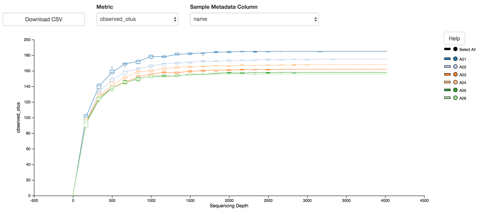

# PipeQiime2Meta
A pipeline for Qiime2 metagenomics analysis

## PipeQiime2Meta_Prepare.sh

To run the workflow, two database files need to be downloaded and saved in the ./bin folder. This can be automatically achieved by running the PipeQiime2Meta_Prepare.sh. This script required `wget`, `unzip`.

```
[Usage]: PipeQiime2Meta_Prepare.sh [Anything_not_empty]
```

## PipeQiime2Meta_QC.sh

Before running the workflow, an optional QC step can be achieved by running PipeQiime2Meta_QC.sh. This script requires `fastqc` and `MultiQC`.

```
[Usage]: PipeQiime2Meta_QC.sh [Path_to_data_directory]
```

## PipeQiime2Meta_Step1.sh

This script imports data and performs QC using Qiime2. This scirpt requires `Qiime2` to be installed.

```
[Usage]: PipeQiime2Meta_Step1.sh [InputDir] [OuputPrefix|Optional, Default prefix is 'data']
```

## PipeQiime2Meta_Step2.sh

This script performs DATA2, feature-table, alignment, phylogeny analyses. DATA2 step is time consuming, which may take a few days. Please use as much RAM and CPUs.

```
[Usage]: PipeQiime2Meta_Step2.sh [InputDir] [MetaTable.csv|Required file]
```

## PipeQiime2Meta_Step3.sh

This script requires an input number of SamplingDepth, which should be smaller than the smallest number of the non-chimeric reads. This script performs Diversity analysis, Rarefaction, Taxonomy bar plot.

```
[Usage]: PipeQiime2Meta_Step3.sh [MetaTable.csv|Required] [SamplingDepth|Lowest non-chim]
```
## Example inputs and outputs

First prepare the original data (./Demo/data) in fastq.gz format. Then prepare the MetaTable.csv file for detail information.

```
PipeQiime2Meta_Step1.sh data Demo
PipeQiime2Meta_Step2.sh data Demo_Metadata.tsv Demo
PipeQiime2Meta_Step3.sh Demo_Metadata.tsv 4000 GTTYGATYMTGGCTCAG GCWGCCWCCCGTAGGWGT Demo

```

Output examples:

1, MultiQC report: multiqc_report.html

2, Alpha rarefaction



3, PCA


4, Classification


